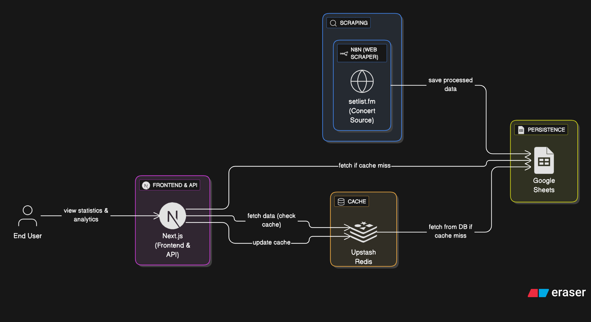

# Morrissey Live Stats — Next.js + n8n + Google Sheets + Redis

Una aplicación que recopila, analiza y muestra estadísticas de canciones tocadas por **Morrissey** en sus conciertos, utilizando automatización con **n8n**, persistencia en **Google Sheets**, y cacheo eficiente con **Redis**.

---

## ⚙️ Flujo de Datos

1. **Scraping automático (n8n)**
   - Cada **24 horas**, un flujo de **n8n** realiza scraping sobre [setlist.fm](https://www.setlist.fm/).
   - Extrae la lista de **conciertos recientes** y **todas las canciones tocadas**.
   - Limpia y estructura los datos (nombre de la canción, cantidad de veces tocada, probabilidad, etc.).
   - Guarda los resultados procesados en una hoja de cálculo de **Google Sheets**.

2. **Persistencia en Google Sheets**
   - Google Sheets actúa como una **base de datos ligera**.
   - Contiene las columnas principales:
     - `song`, `plays`, `percent`, `prob_next`, `tier`, `era`, `comment`
   - Este archivo es actualizado automáticamente por n8n.

3. **Next.js (Frontend)**
   - La aplicación Next.js consume la información desde la **API de Google Sheets**.
   - Dado que Google Sheets **no soporta alto volumen de requests**, la app utiliza un sistema de **cacheo en Redis**.
   - Cuando se realiza una consulta:
     1. Se busca primero en **Redis**.
     2. Si no hay datos cacheados, se consulta **Google Sheets**.
     3. Los resultados se guardan temporalmente en Redis con un **TTL configurable** (por ejemplo, 6 horas).

4. **Redis (Cache Layer)**
   - Acelera las respuestas y reduce la carga sobre Google Sheets.
   - Permite servir miles de peticiones por minuto sin alcanzar los límites de la API.

---

## 🧰 Tecnologías Utilizadas

| Tecnología | Rol | Descripción |
|-------------|-----|-------------|
| **Next.js 14** | Frontend SSR/ISR | Renderizado dinámico y estático de estadísticas y rankings. |
| **Upstash Redis** | Cache | Almacén en memoria distribuido sin servidor (serverless) para respuestas rápidas. |
| **Google Sheets API** | Base de datos ligera | Almacena los datos agregados desde n8n. |
| **n8n** | Automatización | Scraping programado y procesamiento de datos. |
| **Node.js** | Backend común | Entorno de ejecución de todos los servicios. |
| **Setlist.fm (Web Scraping)** | Fuente de datos | Información pública de conciertos y setlists. |

---

## 🖼️ Diagrama de Arquitectura

---
